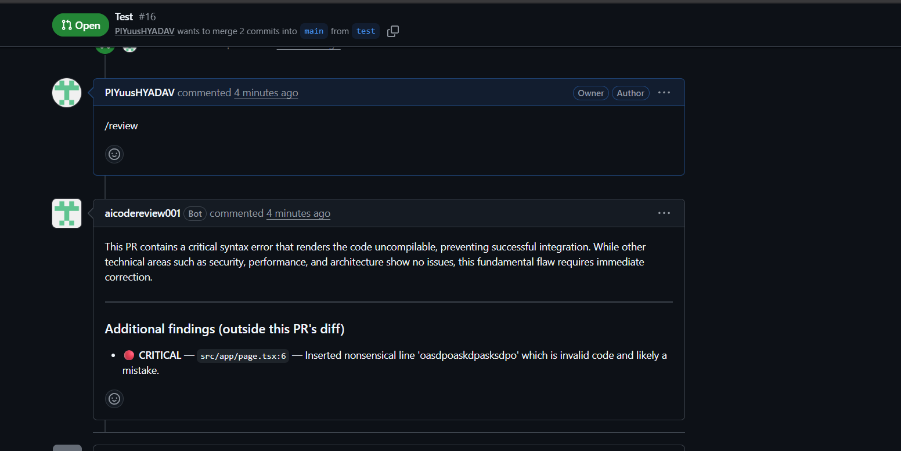
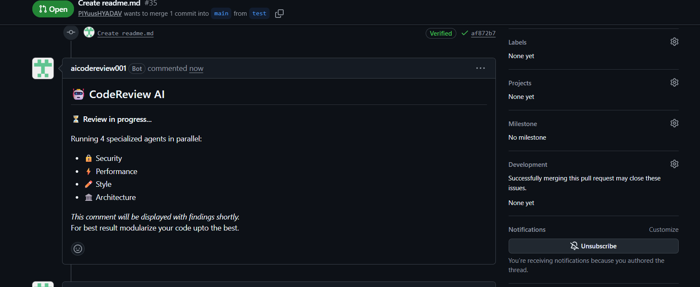
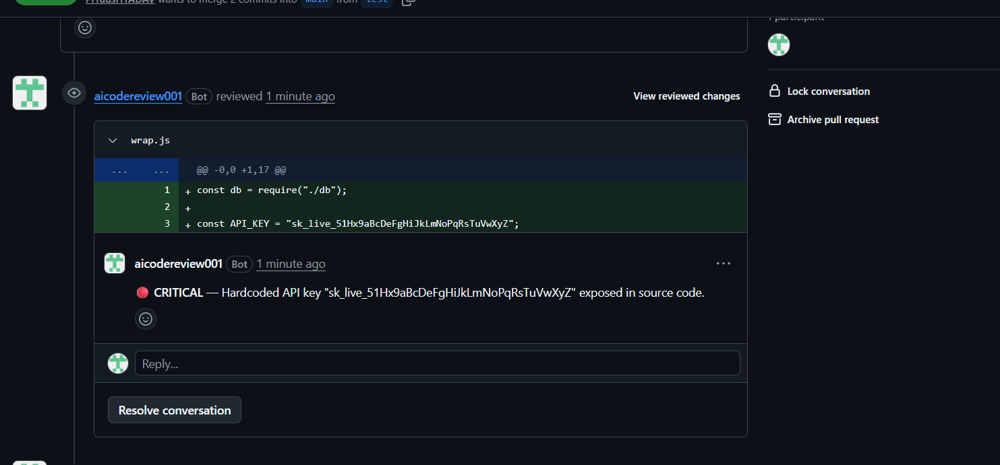
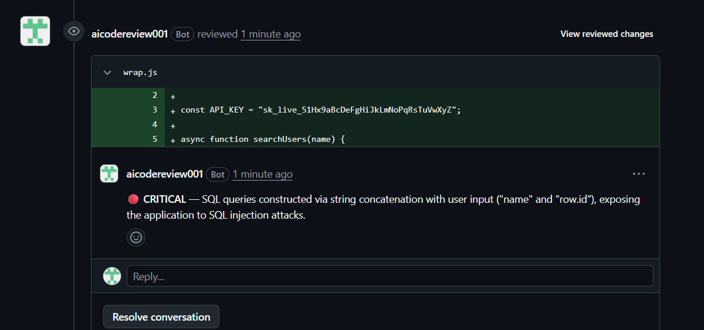
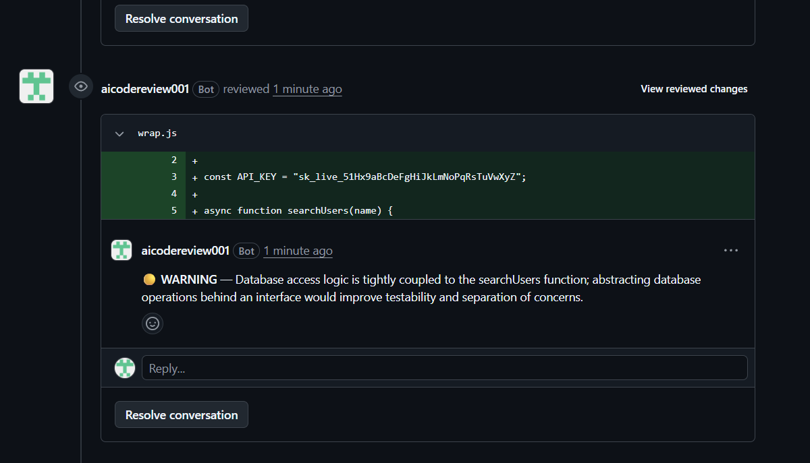
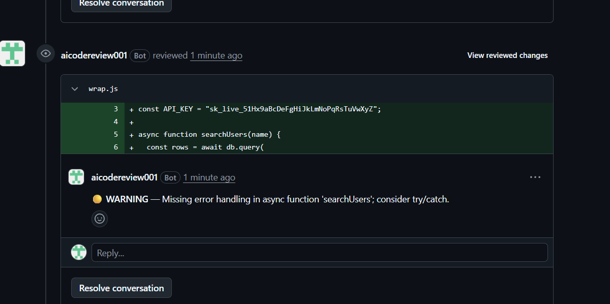
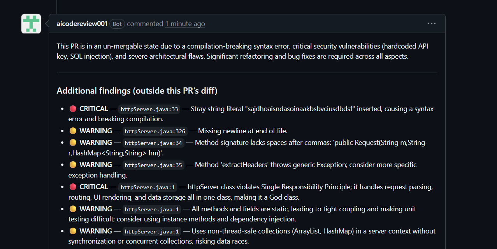
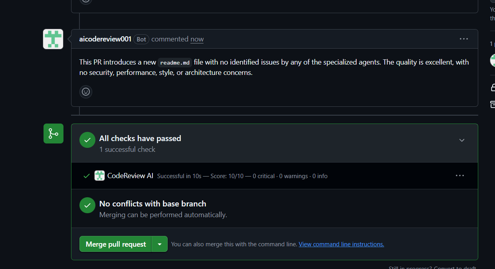

# CodeReview AI

[](https://github.com/PIYuusHYADAV/CodeReviewAI/actions/workflows/ci.yml)


A GitHub App that reviews every pull request with **four specialized LLM agents running in parallel**, then posts the findings as inline comments on the exact changed lines plus a scored GitHub Check Run, usually within seconds.

**[▶ Watch the 3-minute demo and see the live site](https://codequant-review.vercel.app/)** · **[Install the app](https://github.com/apps/aicodereview001)**



## Contents

[Why this project](#why-this-project) · [Demo](#demo) · [What it does](#what-it-does) · [Architecture](#architecture) · [Key design decisions](#key-design-decisions) · [Fault tolerance](#fault-tolerance) · [Tech stack](#tech-stack) · [Setup](#run-it-locally) · [Deploy](#deployment) · [Testing](#testing) · [Limitations and roadmap](#limitations-and-roadmap)

## Why this project

Code review is slow and inconsistent: reviewers miss secrets and injection bugs, and authors wait hours for feedback. Most "AI review" demos are a single prompt behind a button. This project treats it as a **production system**: a signed webhook, a queue, idempotent processing, retries, isolated agents and a tested failure path, so a bad LLM response or a crashed worker never loses or duplicates a review.

## Demo

- **Video:** a 3-minute walkthrough of install, opening a PR, the review landing and re-running with `/review` is on the [live site](https://codequant-review.vercel.app/).
- **Try it yourself:** install the [GitHub App](https://github.com/apps/aicodereview001) on a test repo, open a pull request, or comment `/review` on an existing one.

### Real output

| | |
|---|---|
|  **Instant reply** while the agents work |  **Security agent** finds a committed API key |
|  **SQL injection** on the exact line |  **Architecture agent** suggests a concrete refactor |
|  **Reliability**: missing try/catch |  **Aggregated summary** with severity-ranked findings |

A clean PR finishes as a real GitHub Check Run (`Successful in 10s — Score: 10/10`):



## What it does

Open a pull request (or comment `/review`) and the app:

1. Posts a placeholder comment straight away and sets a Check Run to "in progress".
2. Runs four agents at once on the diff: **security, performance, style, architecture**.
3. Merges their output with a Gemini aggregator into one score, a summary and de-duplicated findings.
4. Posts the findings as inline comments on the exact changed lines and finishes the Check Run (pass or fail).

**Triggers and controls**

| Action | Result |
|---|---|
| PR `opened` or `synchronize` | Automatic review |
| Comment `/review` on a PR | On-demand re-run (rate limited) |
| Title contains `[wip]`, `[skip-review]`, or starts with `wip:` / `draft:` | Review skipped |

## Architecture

```
GitHub ──webhook──▶ Next.js route (Vercel)
                     │ verify HMAC · filter event · rate limit
                     ▼
                 BullMQ queue (Upstash Redis)
                     ▼
                 Worker (Render, concurrency 3)
                     │ claim review (Postgres) ─ duplicate? → wait for the owner's result
                     ▼
        ┌──── Security ── Performance ── Style ── Architecture ────┐   Groq, in parallel
                     ▼
                 Gemini 2.5 Flash aggregator
                     ▼
        publish: inline comments + summary + Check Run (every PR that shares the result)
```

The web app only validates and enqueues; all slow work happens in the worker, so a webhook always answers quickly and GitHub never retries.

## Key design decisions

| Decision | Why |
|---|---|
| Separate worker behind a queue | GitHub expects a response in seconds; LLM calls take longer and fail. Decoupling keeps the webhook fast and makes work retryable. |
| One review per `repo + tree SHA` | Identical code (same tree) is never paid for twice, even across different PRs, branches or re-pushes. |
| Owner / waiter claiming with one atomic upsert | Concurrent identical requests cannot both run. Waiters receive the owner's result on their own PR and Check Run, exactly once. |
| Four narrow agents instead of one big prompt | Smaller, focused prompts give better findings, run in parallel, and a failing agent does not take down the others. |
| Cheap fast model for agents, stronger model to aggregate | Keeps latency and cost low while still producing one coherent verdict. |
| Fail open on Redis rate limiting | A cache outage should degrade protection, not block reviews. |

## Fault tolerance

| Concern | How it is handled |
|---|---|
| Forged requests | HMAC-SHA256 signature, constant-time compare; invalid requests get 401 before any work |
| Noisy repos | Redis rate limits: 3 events per PR and 20 per repo per minute |
| Duplicate work | One review per `repo + tree SHA`, enforced by a unique database row and a deterministic job ID |
| Simultaneous identical requests | An atomic `INSERT ... ON CONFLICT DO UPDATE ... RETURNING` picks one **owner**; the rest become **waiters** and get the same result on their own PR and Check Run, exactly once |
| Transient failures | BullMQ retries: 5 attempts, exponential backoff starting at 5 s |
| Permanent failure | Job is marked failed in Postgres and any waiting requests are failed too, so nothing hangs |
| Crashed worker | A claim older than 15 minutes can be taken over; a daily GitHub Actions job reconciles stale reviews |
| Bad LLM output | Agent errors are rethrown (not cached as an empty review) so retries can recover |
| One agent failing | Agents are isolated; the others still report |
| Redis down | Rate limiting fails open so reviews still run |

## Tech stack

- **App:** Next.js 16 (App Router), React 19, Tailwind CSS v4, NextAuth
- **Queue and cache:** BullMQ, Upstash Redis (ioredis)
- **Database:** Postgres (Supabase) with Drizzle ORM and SQL migrations
- **AI:** Groq `openai/gpt-oss-20b` for the agents, Gemini 2.5 Flash for aggregation
- **GitHub:** Octokit with GitHub App authentication
- **Quality:** TypeScript, ESLint, Vitest, GitHub Actions CI
- **Deploy:** Vercel (web), Render (worker), Docker for both. Runs on free tiers.

## Project structure

```
src/app/            Pages (home, how-it-works, security, deployment) and API routes
  api/webhook/github/   Webhook entry point
components/         UI: architecture diagram, request timeline, screenshot gallery, and an optional lazy-loaded interactive simulator
lib/                Agents, aggregator, GitHub client, publishing, queue, rate limiting
Worker/             BullMQ worker and the stale-job reconciler
repository/         Database access (claim, waiters, results)
config/db/          Drizzle schema
drizzle/            SQL migrations
tests/              Vitest tests
public/screenshots/ Real PR output used by the site and this README
.github/workflows/  CI and the daily reconcile job
```

## Run it locally

You need Node 22+, Postgres, Redis, and a GitHub App.

```bash
git clone https://github.com/PIYuusHYADAV/CodeReviewAI.git && cd CodeReviewAI
npm install
cp .env.example .env.local   # then fill in the values below
npx drizzle-kit migrate
npm run dev        # web on :3000
npm run worker     # worker in a second terminal
```

Or run everything (web, worker, Postgres, Redis) with Docker:

```bash
docker compose up --build
```

### Create the GitHub App

1. GitHub → Settings → Developer settings → GitHub Apps → New.
2. **Webhook URL:** your tunnel URL + `/api/webhook/github` (use ngrok or localtunnel locally). **Webhook secret:** same value as `WEBHOOK_SECRET`.
3. **Repository permissions:** Pull requests (read and write), Issues (read and write, for comments), Checks (read and write), Contents (read).
4. **Subscribe to events:** Pull request, Issue comment.
5. Generate a private key and put its contents in `privatekey`.

### Environment variables

| Variable | Purpose |
|---|---|
| `APP_ID` | GitHub App ID |
| `privatekey` | GitHub App private key (PEM contents) |
| `WEBHOOK_SECRET` | Secret used to sign webhooks |
| `GITHUB_CLIENT_ID`, `GITHUB_CLIENT_SECRET` | OAuth credentials for sign-in |
| `Groq_Token` | Groq API key (agents) |
| `Gemini_Key` | Gemini API key (aggregator) |
| `DATABASE_URL` | Postgres connection string |
| `REDIS_URL` | Redis connection string |
| `NEXTAUTH_SECRET`, `NEXTAUTH_URL` | NextAuth configuration |
| `NEXT_PUBLIC_VIDEO_URL` | Embed URL of the walkthrough video shown on the site |
| `POSTGRES_USER`, `POSTGRES_PASSWORD`, `POSTGRES_DB` | Only for `docker compose` |

Never commit `.env*` files or the `.pem` key (both are in `.gitignore`).

## Deployment

| Part | Where | Notes |
|---|---|---|
| Web app and webhook | Vercel | `output: "standalone"`; deploys are triggered by the CI workflow after tests pass |
| Worker | Render (Docker, `Dockerfile.worker`) | Long-running process; scale by raising BullMQ concurrency |
| Postgres | Supabase | Run `npx drizzle-kit migrate` on schema changes |
| Redis | Upstash | Queue, cache and rate limits |
| Stale-job reconcile | GitHub Actions (daily cron) | `.github/workflows/reconcile.yml` |

## Testing

```bash
npm run test:run
```

22 test cases across 4 files cover rate limiting, diff-line mapping (so comments land on valid lines), and database claiming.

The **concurrency tests** (`tests/concurrency.test.ts`) run against a real Postgres (PGlite, in-process, using the project's actual migrations) rather than a mock, because the guarantee lives in the database. They prove that:

- 10 simultaneous identical requests produce exactly one owner and nine waiters, and one database row
- a failed review, or a claim stale for over 15 minutes, is taken over by exactly one retry; a fresh in-progress claim is never stolen
- a request arriving after completion gets the stored result
- a waiter that registers just after the owner finished still receives the result, and concurrent delivery to one waiter succeeds exactly once

CI runs the type check, tests and build on every push to `main` before deploying.

## Limitations and roadmap

Honest scope, so expectations match reality:

- Reviews are based on the PR diff plus file context; very large files are trimmed (8,000 characters of full-file context are sent to the model), so findings on huge files may be incomplete.
- Findings are LLM output and can be wrong. Treat them as a first pass, not a gate; there is no per-repo configuration for severity thresholds yet.
- Free-tier LLM rate limits cap throughput under heavy load.

Planned: per-repo config file (`.codereview.yml`) for enabled agents and thresholds, a feedback reaction (👍/👎) loop to measure finding quality, an evaluation set of PRs with known bugs to track precision and recall, and observability (metrics and tracing) for queue depth and agent latency.

## Author

Built by [Piyush Yadav](https://github.com/PIYuusHYADAV). Feedback and issues are welcome.
